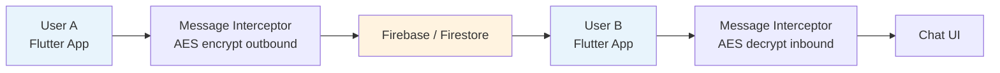
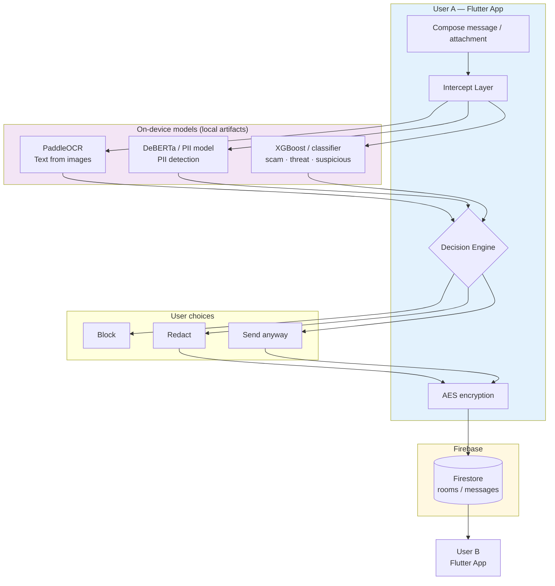
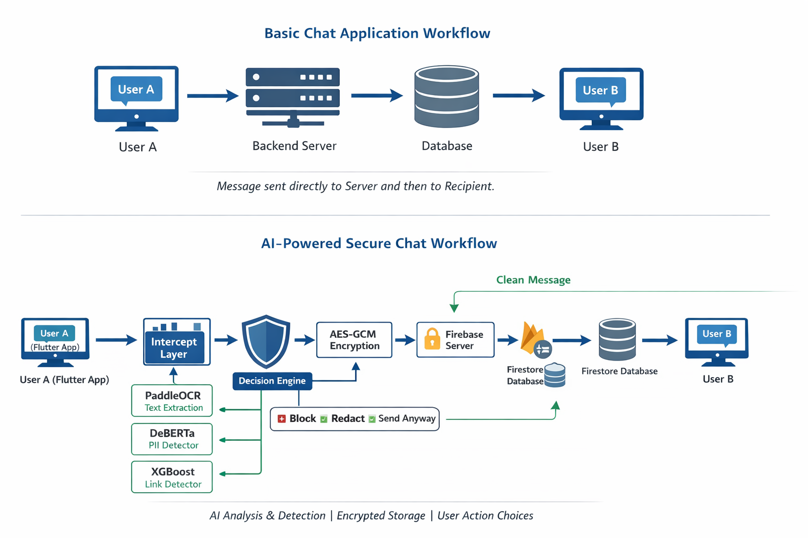
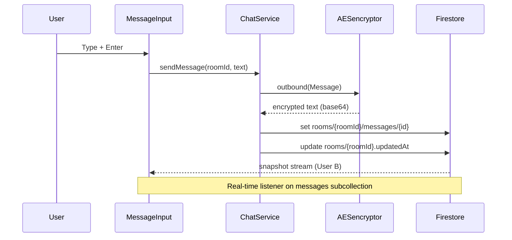

# Chat Desktop

A **Flutter desktop chat application** (Windows-first) backed by **Firebase Authentication** and **Cloud Firestore**, with a pluggable **message interceptor pipeline** for outbound/inbound message processing. The app supports real-time direct messaging, file attachments, and **AES encryption** at the client before data is written to Firestore.

A planned **AI-powered security layer** (trained on custom datasets) will run inside `lib/interceptors/` for **PII detection**, **multi-label threat classification** (scam, threat, suspicious), and user-driven actions (block, redact, send anyway). Model artifacts are **not stored in this repository** due to size limits.

---

## Table of contents

- [Overview](#overview)
- [Features](#features)
- [Tech stack](#tech-stack)
- [Architecture](#architecture)
- [Workflow diagrams](#workflow-diagrams)
- [Message interceptor pipeline](#message-interceptor-pipeline)
- [ML models (local only)](#ml-models-local-only)
- [Firestore data model](#firestore-data-model)
- [Security rules](#security-rules)
- [Project structure](#project-structure)
- [Prerequisites](#prerequisites)
- [Setup & run](#setup--run)
- [Multi-device / team setup](#multi-device--team-setup)
- [Code generation](#code-generation)
- [Roadmap](#roadmap)
- [License](#license)

---

## Overview

**Chat Desktop** is a desktop-native messaging client built with Flutter. Users register and sign in with **email/password**, discover other users from Firestore, open a **1:1 DM room**, and exchange messages in **real time** via Firestore snapshots.

Messages pass through a **`MessageInterceptor`** abstraction before persistence and after retrieval. Today this layer applies **AES-CBC encryption** to message text. The target design extends the same hook with **on-device ML inference** for privacy and safety, then encrypts only approved/redacted content before it reaches Firebase.

| Layer | Responsibility |
|--------|----------------|
| **UI** (`screens/`) | Auth, people list, chat pane, message input, attachments |
| **State** (`providers.dart`) | Riverpod providers for auth, users, chat, selection |
| **Services** (`services/`) | Auth, user search, room/message CRUD |
| **Interceptors** (`interceptors/`) | Transform messages on send/receive (encryption, future ML) |
| **Backend** | Firebase Auth + Firestore (real-time sync) |

---

## Features

### Implemented

- Email/password **registration** and **login**
- User profiles stored in `/users/{uid}` with online status and `lastSeen`
- **People** sidebar with search (name/email)
- **1:1 DM rooms** with automatic `findOrCreateDM`
- **Real-time** message stream (`orderBy createdAt`)
- **Text messages** and **file/image attachments** (Base64 in Firestore)
- **Client-side AES encryption** for message text (`AESencryptor`)
- **Firestore security rules** scoped to room members
- Desktop UI: split pane (contacts + conversation)

### Planned (interceptor / ML)

- **PII detection** (e.g. DeBERTa-based NER/classification on message text)
- **Multi-label classification**: `scam`, `threat`, `suspicious` (and related labels from your datasets)
- **Link / URL risk scoring** (e.g. XGBoost on extracted features)
- **OCR for images** (e.g. PaddleOCR) when attachments contain text
- **Decision engine**: Block → Redact → Send anyway
- Optional upgrade to **AES-GCM** for authenticated encryption

---

## Tech stack

| Category | Technology |
|----------|------------|
| Framework | Flutter 3.x (Dart SDK `>=3.2.0`) |
| Target | **Windows** desktop (also supports Android/iOS/macOS/web scaffolding) |
| Backend | Firebase Core, Firebase Auth, Cloud Firestore |
| State management | `flutter_riverpod` |
| Models | `freezed` + `json_serializable` |
| Encryption | `encrypt` package (AES-CBC, fixed key/IV in code — see [Security notes](#security-notes)) |
| IDs | `uuid` |
| File pick | `file_picker`, `desktop_drop` |
| UI | Material 3, `google_fonts`, custom gradients |

---

## Architecture

```text
┌─────────────────────────────────────────────────────────────────┐
│                     Flutter Desktop App (Windows)                  │
├─────────────────────────────────────────────────────────────────┤
│  LoginScreen / RegisterScreen  →  HomeScreen                       │
│    ├─ LeftPane (UserService.searchUsers)                           │
│    └─ RightPane (ChatService.messagesFor + MessageInput)         │
├─────────────────────────────────────────────────────────────────┤
│  Riverpod: authStateProvider, chatServiceProvider, ...             │
├─────────────────────────────────────────────────────────────────┤
│  ChatService                                                       │
│    sendMessage / sendFileMessage                                   │
│      → MessageInterceptor.outbound()  [AES today; ML planned]     │
│      → Firestore: rooms/{roomId}/messages/{messageId}              │
│    messagesFor(roomId)                                             │
│      ← Firestore snapshots                                         │
│      ← MessageInterceptor.inbound()                                │
├─────────────────────────────────────────────────────────────────┤
│  Firebase Auth  +  Cloud Firestore                                 │
└─────────────────────────────────────────────────────────────────┘
```

**Auth flow:** `FirebaseAuth` session → `AuthService.authStateChanges` loads `/users/{uid}` → UI routes to `HomeScreen` or `LoginScreen`.

**Chat flow:** Select contact → `findOrCreateDM(otherUid)` creates or reuses a room with `members: [uidA, uidB]` → messages read/written under `/rooms/{roomId}/messages`.

---

## Workflow diagrams

### 1. Basic chat workflow (current backend path)

Messages go from the Flutter client to Firebase and back. Encryption runs in the client interceptor before write.



*Caption: Message is sent to the server (Firestore), stored, and delivered to the recipient in real time.*

---

### 2. AI-powered secure chat workflow (target design)

This is the **intended end-to-end pipeline** once ML models are integrated into `lib/interceptors/`. Analysis runs **on-device** before any ciphertext is uploaded.



| Stage | Description |
|-------|-------------|
| **Intercept layer** | Single extension point (`MessageInterceptor`) chaining OCR, PII, and classification |
| **Decision engine** | Maps model scores + policy to Block / Redact / Send anyway |
| **Encryption** | Only approved (or redacted) payload is encrypted and written to Firestore |
| **Recipient** | Inbound path decrypts and renders; optional re-scan on receive |

*Caption: AI analysis & detection · encrypted storage · explicit user action choices.*

---

---

### 3.Worflow Diagram



### 4. Sequence: send one text message (as implemented today)



---

## Message interceptor pipeline

All send/receive transformations go through one interface:

```dart
abstract class MessageInterceptor {
  Future<Message> outbound(Message original);
  Future<Message> inbound(Message encrypted);
}
```

| File | Role | Status |
|------|------|--------|
| `message_interceptor.dart` | Interface + `PlainTextInterceptor` passthrough | ✅ |
| `aes_interceptor.dart` | AES-CBC encrypt/decrypt on `Message.text` | ✅ |
| `pii_interceptor.dart` *(planned)* | Run PII model; redact spans | 🔜 |
| `threat_interceptor.dart` *(planned)* | Multi-label scam/threat/suspicious | 🔜 |
| `composite_interceptor.dart` *(planned)* | Chain: ML → decision → AES | 🔜 |

**`ChatService`** wires the interceptor today:

```dart
final MessageInterceptor interceptor = AESencryptor();
// outbound before .set(), inbound inside messagesFor() stream
```

**Planned composite outbound order:**

1. Normalize text (and OCR attachment text if present)
2. PII detection → optional auto-redact
3. Multi-label threat classifier
4. Decision UI if thresholds exceeded
5. AES encrypt approved payload
6. Write to Firestore

---

## ML models (local only)

Trained model weights and large datasets **are not committed to GitHub** (size, licensing, and reproducibility). Collaborators install them locally.

### Expected layout (add to your machine, not the repo)

```text
chat_desktop/
├── assets/
│   └── models/              # ← gitignored
│       ├── pii/             # DeBERTa (or export ONNX/TFLite)
│       ├── threat/          # Multi-label classifier weights
│       ├── links/           # XGBoost / sklearn export
│       └── ocr/             # PaddleOCR models
├── lib/interceptors/
│   ├── message_interceptor.dart
│   ├── aes_interceptor.dart
│   ├── pii_interceptor.dart      # you add
│   └── threat_interceptor.dart   # you add
```

### Recommended `.gitignore` entries

```gitignore
# ML artifacts (large binaries)
assets/models/
*.onnx
*.tflite
*.pt
*.pth
*.bin
*.h5
*.pb
datasets/
```

### Obtaining models for development

1. Train/export models in your ML environment (PyTorch, Hugging Face, XGBoost, etc.).
2. Copy exports into `assets/models/` on each developer machine.
3. Declare paths in `pubspec.yaml` under `flutter: assets:` when ready.
4. Load via your chosen runtime (e.g. `tflite_flutter`, `onnxruntime`, or platform channel to Python for desktop).
5. Document **minimum versions** and **checksums** in an internal wiki or `docs/MODELS.md` (optional).

### Labels (multi-label classification)

Document your label set alongside the model card, for example:

| Label | Meaning |
|-------|---------|
| `scam` | Fraudulent or deceptive content |
| `threat` | Violence, coercion, or credible threats |
| `suspicious` | Phishing-like or high-risk but uncertain |

Thresholds and UI copy should live in config (e.g. `lib/config/safety_policy.dart`) rather than hard-coded in widgets.

---

## Firestore data model

### `/users/{userId}`

| Field | Type | Description |
|-------|------|-------------|
| `id` | string | Same as Auth UID |
| `email` | string | Login email |
| `name` | string | Display name |
| `photoUrl` | string | Avatar URL |
| `isOnline` | bool | Presence flag |
| `lastSeen` | string (ISO8601) | Last activity |

### `/rooms/{roomId}`

| Field | Type | Description |
|-------|------|-------------|
| `id` | string | Room UUID |
| `name` | string | e.g. `"DM"` |
| `members` | `string[]` | Exactly two UIDs for DM |
| `updatedAt` | string (ISO8601) | Bumped on new message |

### `/rooms/{roomId}/messages/{messageId}`

| Field | Type | Description |
|-------|------|-------------|
| `id` | string | Message UUID |
| `roomId` | string | Parent room |
| `senderId` | string | Author UID |
| `text` | string | **Encrypted** (base64 ciphertext) for text messages |
| `createdAt` | string (ISO8601) | Ordering key |
| `fileName` | string? | Attachment name |
| `fileData` | string? | Base64 file bytes |
| `unreadBy` | string[] | Optional read receipts |

**DM creation:** `ChatService.findOrCreateDM(otherId)` queries rooms where `members` contains the current user, reuses a 2-member room containing `otherId`, or creates a new room with `members: [myUid, otherId]`.

---

## Security rules

Rules live in `firestore.rules` at the repo root. Summary:

- **`/users`**: any signed-in user can read; only the owner can write their doc.
- **`/rooms`**: create only if caller is in `members`; read/update/delete only for members.
- **`/rooms/{roomId}/messages`**: read/write only if caller is a member of the parent room.

Deploy after changes:

```bash
firebase deploy --only firestore:rules
```

---

## Project structure

```text
lib/
├── main.dart                 # Firebase init, theme, auth routing
├── firebase_options.dart     # Generated — NOT in git (see Setup)
├── providers.dart            # Riverpod providers
├── interceptors/
│   ├── message_interceptor.dart
│   └── aes_interceptor.dart
├── models/
│   ├── app_user.dart
│   ├── message.dart
│   └── room.dart
├── services/
│   ├── auth_service.dart
│   ├── user_service.dart
│   └── chat_service.dart
├── screens/
│   ├── auth/                 # login, register
│   └── home/                 # left/right panes, bubbles, input
└── utils/
firestore.rules
.firebaserc
pubspec.yaml
docs/                         # Optional: MODELS.md, workflow assets
```

---

## Prerequisites

- [Flutter SDK](https://docs.flutter.dev/get-started/install) (3.2+)
- **Windows desktop** enabled: `flutter config --enable-windows-desktop`
- [Firebase CLI](https://firebase.google.com/docs/cli) (`firebase login`)
- A Firebase project with **Authentication (Email/Password)** and **Firestore** enabled
- [FlutterFire CLI](https://firebase.flutter.dev/docs/cli-setup/) for `firebase_options.dart`

---

## Setup & run

### 1. Clone and install dependencies

```bash
git clone <your-repo-url>
cd chat_desktop
flutter pub get
```

### 2. Firebase configuration

`lib/firebase_options.dart` is **gitignored**. Generate it locally:

```bash
dart pub global activate flutterfire_cli
flutterfire configure
```

Select your Firebase project (e.g. `chat-desktop-c7b7d`). This creates `lib/firebase_options.dart` for Windows and other platforms.

### 3. Enable Firebase services

In [Firebase Console](https://console.firebase.google.com/):

1. **Authentication** → Sign-in method → **Email/Password** → Enable  
2. **Firestore** → Create database (production or test mode, then deploy rules from this repo)

### 4. Run on Windows

```bash
flutter run -d windows
```

Release build:

```bash
flutter build windows
```

Output: `build/windows/x64/runner/Release/`

---

## Multi-device / team setup

To chat between two machines in real time:

1. **Same Firebase project** — both apps must use the **same** `firebase_options.dart` / `projectId` (e.g. `chat-desktop-c7b7d`).
2. **Separate accounts** — each person **registers** in the app (creates `/users/{uid}`).
3. **Start DM** — User A searches User B in **People** and taps their row (`findOrCreateDM`).
4. **Rules** — both UIDs must appear in `room.members` (handled automatically by `findOrCreateDM`).
5. **Encryption** — both builds must share the **same** `AESencryptor` key/IV (or messages will not decrypt correctly).
6. **ML models** — each machine needs the same files under `assets/models/` when that layer is enabled.

> **Note:** `firebase use` only sets the CLI default project for deploys. The running app uses `DefaultFirebaseOptions.currentPlatform` from `firebase_options.dart`.

---

## Code generation

Models use Freezed and JSON serialization:

```bash
dart run build_runner build --delete-conflicting-outputs
```

Run after changing `app_user.dart`, `message.dart`, or `room.dart`.

---

## Security notes

| Topic | Current behavior | Recommendation |
|-------|------------------|----------------|
| AES key/IV | Hard-coded in `aes_interceptor.dart` | Move to secure storage or per-user keys for production |
| Mode | AES-CBC | Consider AES-GCM for integrity + confidentiality |
| File attachments | Base64 in Firestore | Size limits; consider Firebase Storage + rules |
| ML | Planned on-device | Keeps raw text off third-party APIs; document false positive handling |
| Rules | Member-scoped | Review before public release |

---

## Roadmap

- [ ] Composite `MessageInterceptor` chaining ML + AES  
- [ ] Integrate PII model (DeBERTa or ONNX export)  
- [ ] Integrate multi-label threat classifier (scam / threat / suspicious)  
- [ ] PaddleOCR path for image attachments  
- [ ] Decision UI: Block / Redact / Send anyway  
- [ ] `docs/MODELS.md` with versions, metrics, and install steps  
- [ ] Firebase Storage for large files  
- [ ] AES-GCM + key management hardening  

---

